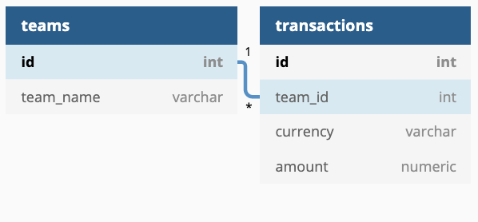
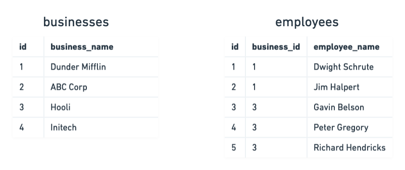

# Coupa Travel Backend Code Challenge

## The Brief

Coupa Travel contracts with a number of different businesses (_businesses_ table) to supply their travel needs.  Each business has a number of employees (_employees_ table) which can access Coupa Travel in order to schedule, book, and modify their upcoming trips. However, each business has unique information they want to store about individual employees in Coupa Travel. 


For example:

ABC Corp wants to store custom fields _Employee ID_ and _Cost Center_ with each of their employees. (The employee id is ABC's internal id, not Coupa Travel's).

Dunder Mifflin wants to store custom fields _Sales Ranking_ and _Rating_. 

Other businesses may want more custom fields, other companies may want fewer.  There may be between 0 to N custom fields per business. The solution you choose should support these other businesses' custom fields without requiring additional engineering work.

## The Challenge

The goal of this task is to build a database schema, and apis for storing these custom fields. You can use SQL or NoSQL, but we'd like to know how you plan on storing this new data in the database and serve up to the frontend.

You can screen share a text editor of your choice to show your thoughts. You could use DbDiagram https://dbdiagram.io/home (you can create a diagram without signing in and we provide the starter schema in starterSchema.txt) or another tool if you would find that helpful.

### Before You Get Started

We recognize this is challenging. The goal isn't for you to complete everything but for us to get a sense of how you solve problems, so if you don't finish all "core requirements", don't worry.  Please ask any clarifying questions and work through your thought process as visibly as possible.  We're excited to see what you create!

## Requirements

### Core Requirements

- Design a schema to store custom data related to an employee.
  - Each business may have an arbitrary number of custom fields.
  - Each business needs to be able to assign a custom name to each of their fields.
  - Custom fields should have values that are either: (a) plain text or (b) single-select multiple choice. 
  - Businesses should be able to indicate what type of value each of their fields should accept.
- Model endpoints for the creation, editing, viewing, and deletion of a business' custom field schema

### Current Data Structure
 


### Example Requests and Responses

`GET /businesses/1/employees`

```
 {
   id: 1
   name: "Dunder Mifflin"
   employees: [
     {
       id: 1,
       name: "Dwight Schrute",
       custom_fields: [
         {
           name: "Sales Ranking",
           value: 2,
         },
         {
           name: "Michael Scott Rating",
           value: 0,
         }
       ]
     },
     {
       id: 2,
       name: "Jim Halpert",
       custom_fields: [
        {
           name: "Sales Ranking",
           value: 1,
         },
         {
           name: "Michael Scott Rating",
           value: 1,
         }
       ]
     }
   ]
 }
```
