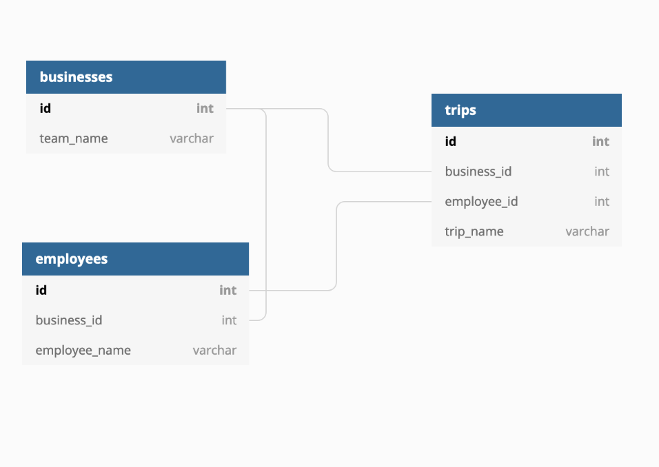

# Pana Backend Code Challenge

## The Brief

Pana contracts with a number of different businesses (_businesses_ table) to supply their travel needs.  Each of those businesses have a number of employees (_employees_ table) which can access Pana in order to schedule, book, and modify their upcoming trips. However, each business has unique information they want to store about individual employees in Pana.  This information will help them track their travel and do month end reconciliation. 

For example:

ABC Corp wants to store custom fields _Employee ID_ and _Cost Center_ with each of their employees. (The employee id is ABC's internal id, not Pana's).

Dunder Mifflin wants to store custom fields _Sales Ranking_ and _Michael Scott Rating_. 

Other businesses may want more custom fields, other companies may want fewer.  There may be between 0 to N custom fields per business. The solution you choose should support these other businesses' custom fields without requiring additional engineering work.

## The Challenge

Using the included API server and your code wizardry, the goal is to implement functionality which allows custom data to be associated with a business' travel employees that are stored in the database.

The goal of this task is to build an understanding of how you would structure databases and APIs, so no coding is actually necessary. We will use a whimsical doc and `NOTES.md` to write out your thoughts.

### Before You Get Started

We recognize that doing anything within a tight time constraint is an extra level of challenge that you won't face in your day to day job as an engineer.  The goal of this challenge isn't for you to complete everything but for us to get a sense of how you solve problems, so if you don't end up finishing the "core requirements" in the time allotted that is not immediate cause for concern.  Please ask any clarifying questions and work through your thought process as visibly as possible.  We're excited to see what you create!

## Requirements

### Core Requirements

- Implement a method to store custom data related to an employee.
  - Each business may have an arbitrary number of custom fields.
  - Each business needs to be able to assign a custom name to each of their fields.
  - Custom fields should have values that are either: (a) plain text or (b) single-select multiple choice. 
  - Businesses should be able to indicate what type of value each of their fields should accept.
- Model endpoints for the creation, editing, viewing, and deletion of a business' custom field schema
- Write an example(/pseudo) query for getting all employees for a business with their custom field values.
- Model an example request for users to users to specify their custom field values on a `POST /employees/:employee_id` request.


### Current Data Structure
 


### Example Requests and Responses

`GET /businesses/1/employees`

```
 {
   id: 1
   name: "Dunder Mifflin"
   employees: [
     {
       id: 1,
       name: "Dwight Schrute",
       custom_fields: [
         {
           name: "Sales Ranking",
           value: 2,
         },
         {
           name: "Michael Scott Rating",
           value: 0,
         }
       ]
     },
     {
       id: 2,
       name: "Jim Halpert",
       custom_fields: [
        {
           name: "Sales Ranking",
           value: 1,
         },
         {
           name: "Michael Scott Rating",
           value: 1,
         }
       ]
     }
   ]
 }
```


## Bonus Materials

If you get this far with time to spare, congratulations! It is absolutely not expected or required to get to this point. If you'd like to go further feel free to pick **one** of the below: 

### Expanded Functionality

- Write an example API Request and Response to create a new custom field. (I.e. If Dwight logged in to create a "Demerits" field).
- Some businesses like to specify a custom field on a per-trip basis instead of a per-employee basis (for example, each employee may have a _Department_ or _Employee ID_). Allow custom fields to be associated with either employees or trips.
- Modify your custom field schema to support multi-select multiple choice. (For example, a user should be able to specify multiple _Cost Centers_ to a single employee.)

### Performance Concerns

- Consider the performance of your solution when the employees database begins to contain millions of rows. Ensure that your solution scales elegantly to prevent increased latency on the employees endpoint with time.
- The `GET /employees` request is going to get quite large as businesses continue to use this project. Add a parameter to this request that allows the user to request specific date ranges, as well as request the report year-to-date, month-to-date, and week-to-date.


### API Validation

- Handle invalid custom field values (for example, attempting to set a plain text value to a custom field which accepts a multiple choice value.)
- There's no security, so anyone can use your new app! For example, one business can currently edit or delete another business' data (BAD!). Describe (with pseudo-code) how you would validate business requests.
